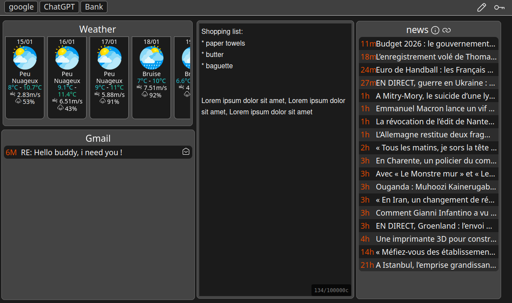
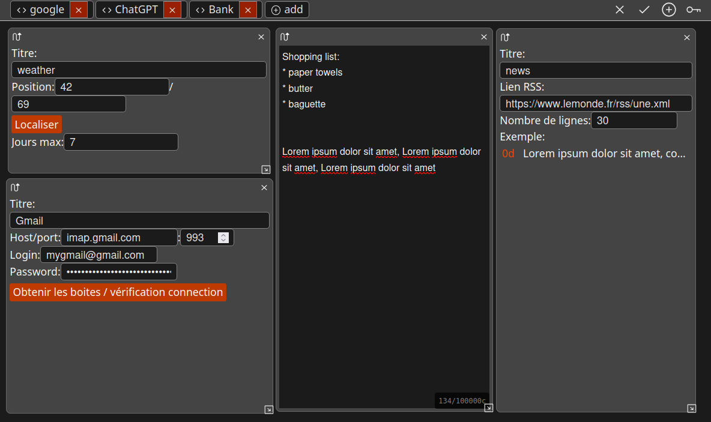

# WebHome

## About

WebHome is a customizable browser home page designed to give you rapid access to the information you need:

- Auto-translation UI (based on your browser language)
- Weather
- Notes
- RSS Feeds
- Emails
- Links

You can freely position any module anywhere on the page to suit your layout preferences.

## Screenshot


## Edit mode screenshot


## Why?

Remember [iGoogle](https://wikipedia.org/wiki/IGoogle)?

After it was closed, I wanted to create a personal alternative. I built the first version of this project in 2013 using PHP. Now, I have rebuilt it from the ground up in Rust, using the [Leptos](https://leptos.dev/) framework.

## Security

This project uses client-side encryption, meaning only encrypted data is sent to the server. Anything stored on the server is encrypted and cannot be read by anyone else.

HOWEVER, due to browser security restrictions, the Mail and RSS modules require the server to act as a proxy:

- **RSS Feeds:** Browser CORS policies prevent requesting data from different domains. Therefore, the server fetches the feed on your behalf. Only the URL is processed; no user information is used or logged.
- **Mail:** Browsers cannot establish IMAP connections directly. The server handles the connection using the provided credentials (host, port, login, and password). No other user information is used, and nothing is logged.

Additionally, the `site.json` configuration file on the server contains a "server salt" that is never sent to the client. If this salt is changed, all data stored on the server will become inaccessible.

## launch/compile

To launch locally :

```bash
cargo leptos watch --wasm-debug
```

For production, you can check the docker dir and/or the github action workflows.

## Configuration

The configuration file is located at `config/site.json`.
Users datas are stored in `config/users` directory.
`dynamic` contains traces, and caches datas.

## Todo

Things to fix :

- cron after a system wakeup seems broken
- after a system wakeup, need to execute all cron one time.

Features I plan to add in the future:

- Calendar module
- Checklist module
- Password change (requires client-side re-encryption of all data)
- Layout system
- Design improvements
- Custom background images
- Theme color configuration
- Change language inside an option menu

## License

Licensed under either of:

* Apache License, Version 2.0 ([LICENSE-APACHE](LICENSE-APACHE) or <http://www.apache.org/licenses/LICENSE-2.0>)
* MIT license ([LICENSE-MIT](LICENSE-MIT) or <http://opensource.org/licenses/MIT>)

at your option.

## Contribution

Unless you explicitly state otherwise, any contribution intentionally submitted for inclusion in the work by you, as defined in the Apache-2.0 license, shall be dual-licensed as above, without any additional terms or conditions.
