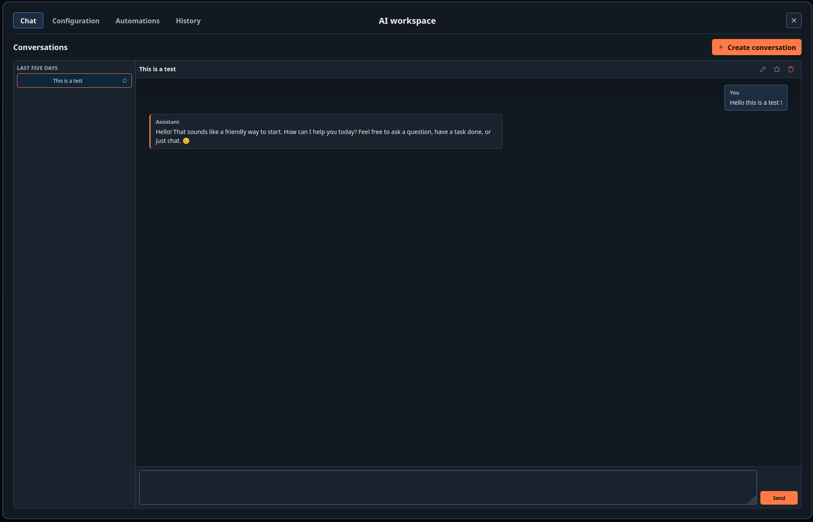
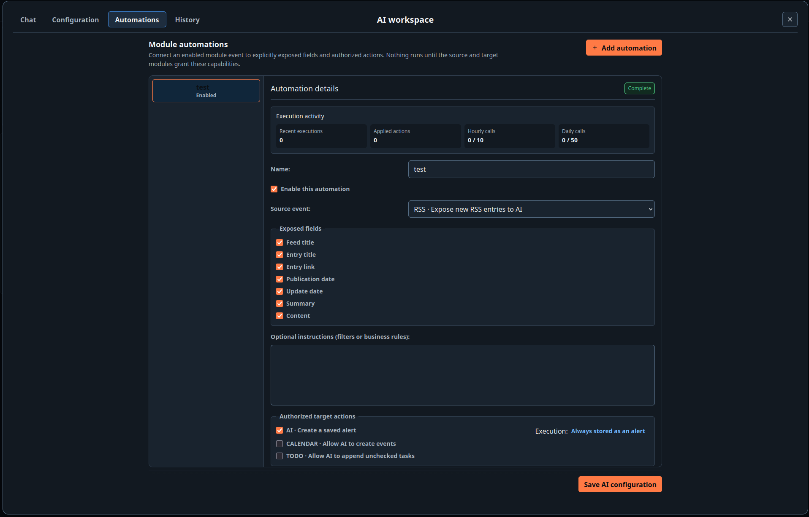
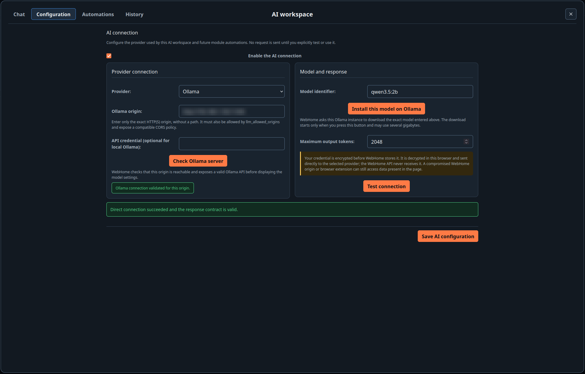

# WebHome

WebHome is a self-hosted, customizable browser home page inspired by [iGoogle](https://wikipedia.org/wiki/IGoogle). It brings frequently used information into one dashboard whose modules can be moved and resized freely.

The project was originally created in PHP in 2013 and is now built in Rust with [Leptos](https://leptos.dev/).

## Features

- Links
- Continuous notes and to-do editor with headings, lists, persistent checkable tasks and automatic HTTP(S) links
- RSS feeds
- Weather forecasts
- Email reading, attachments and mark-as-read actions through IMAP
- Multi-collection CalDAV calendars with month/week views, recurring events, weekend and holiday highlighting, and event creation, editing or deletion
- Account settings for English/French language selection, primary hue customization and password changes
- Encrypted client-side AI configuration, an account-wide Chat workspace, saved alerts and explicit module automations

## Screenshots

| Dashboard | Module configuration in edit mode |
| :---: | :---: |
| [](example.png) | [](example_edit.png) |

## Run WebHome

### Development

Install the Rust toolchain and `cargo-leptos`, then run:

```bash
cargo leptos watch --wasm-debug
```

WebHome is available at `http://127.0.0.1:3002` by default.

### Docker example

A functional Docker image, build script and Compose configuration are available in [`docker/`](docker/). They are provided as a deployment example and should be adapted to the target environment.

## Configuration

WebHome creates `config/site.json` on first start. User records are stored under `config/users`, while runtime traces and caches are stored under `dynamic`.

| Option | Default | Description |
| --- | --- | --- |
| `salt` | Generated automatically | Server salt used to derive stored identities. Back it up and never change it: existing data would become inaccessible. |
| `allow_registration` | `true` | Enables account registration. Set it to `false` when public registration is not wanted. |
| `trace_front_log` | `true` in development | Enables bounded browser traces. It is always disabled when `ENV=PROD`. |
| `imap_allowed_ports` | `[993]` | Non-empty list of TLS IMAP ports users may configure. Invalid values disable IMAP connections until corrected. |
| `caldav_allowed_origins` | `[]` | Exact origins that Calendar modules may contact directly, for example `["https://calendar.example.com"]`. HTTPS is mandatory in production; HTTP is accepted only with `ENV=DEV` for local development. Paths and wildcards are rejected; any invalid entry disables the complete list. |
| `llm_allowed_origins` | `[]` | Exact custom or Ollama origins that the browser may contact directly. The same HTTPS, development HTTP and validation rules as `caldav_allowed_origins` apply. Public supported provider origins are built into the CSP. |

Back up the complete `config` directory. It contains the server salt and all persistent user records.

## To-do editor

The to-do module stays directly editable: typing a supported marker followed by a space at the beginning of a line changes that line in place.

| Input | Result |
| --- | --- |
| `# `, `## ` or `### ` | Heading |
| `- ` | Simple list item |
| `* ` | Unchecked task |
| `*x ` | Completed task, kept visible and crossed out |
| `http://...` or `https://...` | Automatically detected link with a separate open action |

Plain text remains supported, and completed tasks stay in the document until they are removed manually.

## AI workspace and automations

The account-wide AI workspace provides Chat and explicit module automations.

| Chat | Automations | Provider configuration |
| :---: | :---: | :---: |
| [](example_ia_chat.png) | [](example_ia_auto.png) | [](example_ia_config.png) |

WebHome supports one active direct BYOK connection per account: OpenAI API, Anthropic, Gemini, Mistral or Ollama. ChatGPT/Codex account login is not integrated.

Automations currently connect selected Mail or RSS events to saved alerts, Calendar events or TODO tasks. They run in the browser while `/home` is open and use only explicitly exposed fields and authorized actions.

## Production constraints

- Serve WebHome over HTTPS. Its authenticated session cookie is `Secure` and is not intended for plain HTTP production use.
- Keep `config` and `dynamic` writable by UID/GID `1000` when using the provided image.
- Allow outbound DNS, HTTPS and configured IMAP traffic. WebHome rejects private and special-purpose proxy destinations.
- Add client-network rate limiting at the reverse proxy, firewall or CDN. WebHome limits failures per account, but it cannot safely provide a deployment-wide IP limit behind every possible proxy setup.
- Calendar modules connect directly from the browser. Configure Radicale CORS for the exact WebHome origin, answer `OPTIONS` preflights, allow `GET`, `PROPFIND`, `REPORT`, `PUT` and `DELETE`, allow the `Authorization`, `Content-Type`, `Depth`, `If-Match` and `If-None-Match` request headers, and expose `ETag`. Add the Radicale origin to `caldav_allowed_origins`.
- LLM connections also run directly in the browser. A custom or Ollama service must allow the WebHome origin through CORS and be listed in `llm_allowed_origins`; HTTPS is mandatory outside local development.

### Caddy example

WebHome does not require Caddy. This minimal [`reverse_proxy`](https://caddyserver.com/docs/caddyfile/directives/reverse_proxy) example assumes Caddy and WebHome share the `internal_web` Docker network:

```caddyfile
home.example.com {
	reverse_proxy webhome:3002
}
```

For public instances, also rate-limit the generated API routes by their stable prefixes:

- `/api/API_user_login*`: a starting point is 30 requests per 15 minutes and per client network;
- `/api/API_user_sign*`: a starting point is 5 requests per hour and per client network.

Rate limiting is not included in the standard Caddy distribution. Use a firewall, CDN, upstream security layer or a separately reviewed Caddy module. Only derive the client address from trusted proxies.

## Security model

Persistent module payloads are encrypted in the browser before they are stored by the server. This protects stored content, but it is not protection against a compromised WebHome server, browser origin or browser extension.

CalDAV credentials are part of that encrypted module configuration. Calendar requests and event contents travel directly between the browser and the configured CalDAV origin; WebHome does not proxy or cache them.

LLM credentials are likewise encrypted as account data and are never sent to the WebHome API. The browser decrypts a credential only to call the selected provider directly. This avoids a backend copy but does not protect a credential from a compromised WebHome origin, delivered frontend or browser extension.

Chat prompts and only the module fields selected in enabled automation contexts follow the same direct browser-to-provider path. The chosen provider can process or retain this data under its own policy. WebHome stores AI configuration, conversations and pending AI actions only through its client-side encrypted account data.

When holiday highlighting is enabled, the browser requests public holidays from Nager.Date by country and year. Successful responses are cached in memory for the browser session; no calendar event or WebHome credential is sent to that service.

RSS and email require server-side proxies because browsers cannot fetch arbitrary feeds or open IMAP connections directly. The server therefore receives RSS URLs and, when email is fetched, the configured IMAP host, port, login and password.

## AI-assisted development

WebHome is openly developed with help from AI agents. Public contribution rules are available in [AGENTS.md](AGENTS.md), and the `before-ia` branch preserves the earlier project history.

## License

WebHome is dual-licensed under either:

- [Apache License 2.0](https://www.apache.org/licenses/LICENSE-2.0)
- [MIT License](https://opensource.org/license/mit)

Third-party credits are listed in [CREDIT.md](CREDIT.md). Unless stated otherwise, contributions submitted for inclusion are licensed under the same terms.
