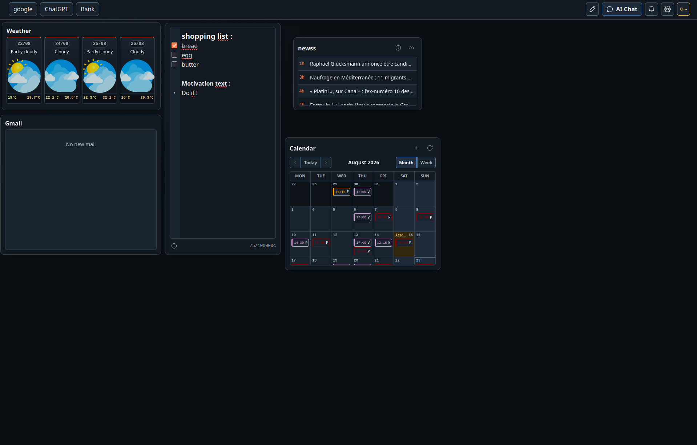
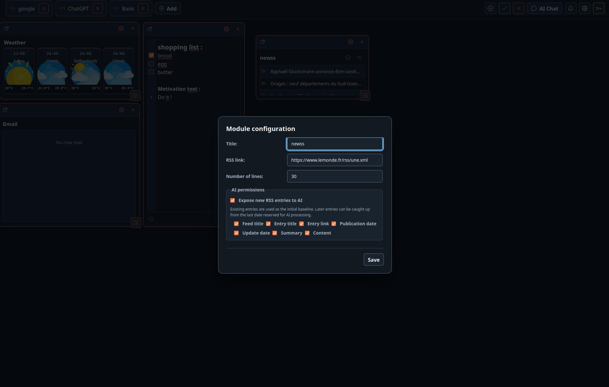

# WebHome

## About

WebHome is a customizable browser home page designed to give you rapid access to the information you need:

- Auto-translation UI (based on your browser language)
- Weather
- Notes
- RSS Feeds
- Emails (can mark them as read, view the full content, download attachments)
- Links

You can freely position any module anywhere on the page to suit your layout preferences.

## Screenshot


## Edit mode screenshot


## Why?

Remember [iGoogle](https://wikipedia.org/wiki/IGoogle)?

After it was closed, I wanted to create a personal alternative. I built the first version of this project in 2013 using PHP. Now, I have rebuilt it from the ground up in Rust, using the [Leptos](https://leptos.dev/) framework.

After the commit "3fb64e1eabdfb20cf4d932ee935690828751d67a", I use a ia assistant to do some stuff. If you want to see the code before that, the branch "before-ia" is for you

## Security

This project encrypts module content in the browser before persistence. The server stores the encrypted module body, but it still sees the module metadata required by the application, the proxy inputs described below, and the HTTP headers sent by the browser. This is protection for persisted content, not a claim that a compromised application server or browser JavaScript can never access user data.

HOWEVER, due to browser security restrictions, the Mail and RSS modules require the server to act as a proxy:

- **RSS Feeds:** Browser CORS policies prevent requesting data from different domains. Therefore, the server fetches the feed on your behalf. The authenticated session is used only to authorize this call; only the URL is sent to the remote server and nothing is logged.
- **Mail:** Browsers cannot establish IMAP connections directly. The server handles the connection using the provided credentials (host, port, login, and password). The authenticated session is used only to authorize this call; no account identifier is sent to the mail server and nothing is logged.

Both proxies accept only destinations whose complete DNS resolution contains public IP addresses. Private, loopback, link-local, multicast, unspecified, metadata and other special-purpose ranges are rejected before connection. RSS redirects are followed only after the new destination has passed the same validation. Network timeouts and server-wide concurrency limits also apply; these application checks do not depend on Caddy or another reverse proxy.

RSS response bodies are limited to 4 MiB. Its server cache uses a five-minute validation TTL and is capped at 64 MiB, 256 entries and 30 days. IMAP operations run outside the asynchronous request workers and are capped in duration and work; a full message, including attachments, is limited to 16 MiB. These defaults intentionally fail closed when a remote server exceeds the limits.

Additionally, the `site.json` configuration file on the server contains a "server salt" that is never sent to the client. If this salt is changed, all data stored on the server will become inaccessible.

### Authentication and encryption model

WebHome deliberately separates authorization from data encryption:

- The browser derives the data-encryption key from the user's inputs and the per-user value returned by the salt endpoint. The raw password and the resulting `userSalt` are not stored in the server-side session. Module payloads remain encrypted before they are persisted.
- The server receives a fixed-size derived credential for authentication and stores an Argon2 verifier. It never needs the module decryption key. The 12-character minimum for new passwords is enforced by the official browser client because the server does not receive the raw password; it is not a server-side password-strength guarantee.
- After a successful login, the server rotates the session identifier and stores only a re-hashed configuration identity in the session. Private module endpoints do not accept an account identifier: they always select the account from this authenticated session.
- The session cookie contains only the opaque tower-sessions identifier. It is `HttpOnly`, `Secure`, `SameSite=Strict`, scoped to `/`, and expires after one day of inactivity. Logging out flushes the server session. If the session expires first, the browser discards its local connected state and asks the user to sign in again.
- Browser preferences and the non-sensitive connected marker live in a separate root cookie. The derived client encryption context lives in the origin-scoped `webhome-crypto` local-storage entry. Browser local storage is not attached automatically to HTTP requests, so the application server and reverse proxy do not receive this context during normal navigation or API calls.

Local storage is isolated by browser origin: another scheme, host or port does not receive access. It remains readable by JavaScript already executing in the WebHome origin, including an XSS, a third-party script loaded by WebHome or a sufficiently privileged browser extension. Protection against those threats requires the browser-content-security work tracked separately and is outside this storage compromise.

Existing installations migrate the former root `webhome` cookie, and the short-lived `/home` crypto-cookie format if present, into local storage before explicitly expiring each cookie with its historical path. Expiration happens only after a successful local-storage write. A request that initially loads the migration code may therefore carry a historical cookie one final time. Existing encrypted module content and its derivation parameters are unchanged. If local storage is later cleared, the same context is derived again at the next login; persisted encrypted modules are not lost.

### Production authentication rate limiting

WebHome limits failed login attempts per account to 3 attempts over 15 minutes. This counter is stored in the server process and is reset when the process restarts.

A production instance exposed to the Internet must also apply an IP or network rate limit at its ingress, reverse proxy, firewall, or CDN. This second limit protects against attempts distributed across many account names and cannot be safely inferred by WebHome when the application is deployed behind an arbitrary proxy. The deployment layer should:

- limit login requests matching `/api/API_user_login*` per IPv4 `/24` and IPv6 `/64` network;
- limit registration requests matching `/api/API_user_sign*` more strictly;
- return HTTP `429` when the limit is exceeded;
- derive the client address only from a trusted proxy chain, never from an unconditionally trusted forwarding header.

The endpoint suffix is generated by Leptos and may change between builds; the function-name prefix remains available for proxy path matching. As an initial policy, 30 login requests per 15 minutes and 5 registrations per hour and per network are reasonable values to tune for the deployment.

#### Optional Caddy example

Caddy's standard `reverse_proxy` sets `X-Forwarded-For` and ignores spoofed incoming values when Caddy is the first proxy. Rate limiting is not included in the standard Caddy distribution. It requires an upstream security layer or a separately reviewed custom module.

The following example uses the third-party [`mholt/caddy-ratelimit`](https://github.com/mholt/caddy-ratelimit) module. It is illustrative: this module is not part of Caddy and must be built and maintained separately.

```caddyfile
home.example.com {
	route {
		rate_limit {
			zone webhome_login {
				match {
					path /api/API_user_login*
				}
				key {client_ip}
				events 30
				window 15m
				ipv4_prefix 24
				ipv6_prefix 64
			}
			zone webhome_registration {
				match {
					path /api/API_user_sign*
				}
				key {client_ip}
				events 5
				window 1h
				ipv4_prefix 24
				ipv6_prefix 64
			}
		}

		reverse_proxy webhome:3002
	}
}
```

If another CDN or proxy is placed in front of Caddy, configure Caddy's [`trusted_proxies`](https://caddyserver.com/docs/caddyfile/options#trusted-proxies) and `trusted_proxies_strict` options before relying on `{client_ip}`.

### Authentication verification gates

The following commands cover the critical authentication and object-authorization regressions and are intended to become mandatory CI gates before publication:

```bash
cargo test --no-default-features --features ssr
cargo check --lib --no-default-features --features hydrate --target wasm32-unknown-unknown
cargo leptos build
```

The SSR suite includes session rotation/logout, legacy verifier migration, real `Set-Cookie` attribute inspection, anonymous module refusal, and isolation between two authenticated accounts. CI workflow ownership and deployment gating are tracked separately so authentication changes do not silently weaken the delivery pipeline.

## launch/compile

To launch locally :

```bash
cargo leptos watch --wasm-debug
```

For production, you can check the docker dir and/or the github action workflows.

## Configuration

The configuration file is located at `config/site.json`.
Users datas are stored in `config/users` directory.
`dynamic` contains traces, and caches datas.

`imap_allowed_ports` is a server-side JSON array containing the implicit-TLS IMAP ports that users may configure. It defaults to `[993]`. Add another port explicitly only when a trusted deployment needs it, for example:

```json
{
	"imap_allowed_ports": [993, 1993]
}
```

An empty, malformed or non-integer list fails closed and disables IMAP proxy connections until the configuration is corrected.

`trace_front_log` enables bounded browser-to-server development traces. It is always forced off when WebHome runs with `ENV=PROD`, even if `site.json` contains `true`.

## Third-party browser assets

WebHome loads [Iconoir 7.11.1](https://github.com/iconoir-icons/iconoir/releases/tag/v7.11.1), licensed under MIT, from this fixed jsDelivr URL:

```text
https://cdn.jsdelivr.net/npm/iconoir@7.11.1/css/iconoir.css
```

The stylesheet is protected by this Subresource Integrity value:

```text
sha384-luECWXGw+Rk0LDPKZ8m2vuzYJnGiJfFabF16BAqKVf7rdp1/jvaViZ+BFXFuaD5H
```

When updating Iconoir, change the versioned URL and its SRI value together. Download the exact new URL, calculate its SHA-384 value, then run the Leptos build and visually check both regular and solid icons. Do not replace the fixed version with a mutable branch or tag.

```bash
curl -fsS "https://cdn.jsdelivr.net/npm/iconoir@VERSION/css/iconoir.css" \
	| openssl dgst -sha384 -binary \
	| openssl base64 -A
```

## Browser Content Security Policy

WebHome enforces a complete Content Security Policy covering Leptos hydration, same-origin server functions and workers, Open-Meteo, Iconoir, and the isolated mail iframe. It was deployed in report-only mode before enforcement so the application's real browser requirements could be checked without regressions.

Browsers can submit violations to the same-origin `POST /csp-report` endpoint. The endpoint accepts only the standard `application/csp-report` and `application/reports+json` formats, with a 16 KiB request limit. It does not store report bodies. Logs are limited to 64 entries per minute and retain only the directive, origins without credentials/path/query, and line/column numbers.

After a CSP change, exercise login, home modules, weather, LINK/RSS navigation, mail rendering and its explicit remote-image action, downloads, editing/dragging, and sleep recovery. Review warnings beginning with `Browser CSP report`; under the enforced policy these warnings identify resources the browser has blocked.

## Todo

Things to fix :

- nothing actually

Features I plan to add in the future:

- Calendar module
- Checklist module
- Password change (requires client-side re-encryption of all data)
- Layout system
- Design improvements
- Option menu with : 
  - Custom background images
  - Theme color configuration
  - Change language inside an option menu

## License

Licensed under either of:

* Apache License, Version 2.0 ([LICENSE-APACHE](LICENSE-APACHE) or <http://www.apache.org/licenses/LICENSE-2.0>)
* MIT license ([LICENSE-MIT](LICENSE-MIT) or <http://opensource.org/licenses/MIT>)

at your option.

## Contribution

Unless you explicitly state otherwise, any contribution intentionally submitted for inclusion in the work by you, as defined in the Apache-2.0 license, shall be dual-licensed as above, without any additional terms or conditions.
